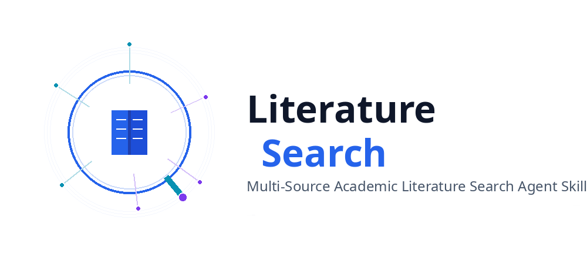

<p align="center">
  
</p>

<h1 align="center" style="font-size: 2.5em; margin: 0.2em 0;">Literature Search Agent</h1>

<p align="center" style="font-size: 1.1em; color: #666; margin-bottom: 1.5em;">
**多源学术论文检索工具** - 为论文写作和研究报告提供全面的文献发现能力。
</p>
<p align="center" style="font-size: 1.1em; color: #666; margin-bottom: 1.5em;">
集成 **7 个学术 API**：arXiv、Semantic Scholar、SerpApi (Google Scholar)、Core API、知网 (CNKI)、百度千帆学术、OpenAlex。
</p>

<p align="center">
<a href="./README.md">English</a> | <a href="./README.zh.md">中文</a>
</p>

## 🚀 快速开始

> 💡 **提示**: 如果你正在使用 AI Agent（如 Claude Code、Cursor、OpenCode 等），可以直接告诉 Agent：
>
> **Install Literature-Search Skill according to the following spec:
> https://github.com/BoringLink/Literature-Search/SPEC.md**

---

### 安装方式

#### 方式 1: npx skills add（推荐）

```bash
npx skills add BoringLink/Literature-Search
```

#### 方式 2: 手动复制

将 `python/literature_search/` 目录复制到你的 IDE skills 文件夹：

- **Claude Code**: `~/.claude/skills/literature-search/`
- **Cursor**: `~/.cursor/skills/literature-search/` 或 `.agents/skills/literature-search/`
- **OpenCode**: `.agents/skills/literature-search/`

#### 方式 3: pip 安装（开发模式）

```bash
pip install -e .
```

---

### 安装依赖

```bash
pip install requests feedparser
```

#### 2. 配置 API 密钥（可选，推荐）

```bash
# Semantic Scholar（提升速率限制）
export SEMANTIC_SCHOLAR_KEY="your-key-here"

# SerpApi（Google Scholar 代理）
export SERPAPI_KEY="your-key-here"

# Core API（开放获取论文）
export CORE_API_KEY="your-key-here"

# 知网研学（中文文献）
export CNKI_USERNAME="your-username"
export CNKI_PASSWORD="your-password"

# 百度千帆学术（中文学术搜索）
export BAIDU_API_KEY="your-key-here"

# OpenAlex（开放学术目录）
export OPENALEX_API_KEY="your-key-here"
```

**注意**: arXiv 不需要 API 密钥。

#### 测试安装

```bash
python -m literature_search --help
```

---

## 📖 基本使用

### 方法 1: Python API（推荐）

```python
from python.literature_search import LiteratureSearcher

# 初始化
searcher = LiteratureSearcher(output_dir="./outputs")
```

### 方法 2: 命令行

```bash
# 基础搜索
python -m literature_search "deep learning" \
    --year-min 2020 \
    --year-max 2024 \
    --category cs.AI \
    --format markdown

# 多关键词搜索
python -m literature_search "federated learning" "privacy" \
    --authors "Yann LeCun" \
    --format json

# 指定 API 源
python -m literature_search "transformer" \
    --sources semantic \
    --max-results 100
```

---

## 🎯 常见使用场景

### 场景 1: 论文文献综述

```python
results = searcher.search(
    keywords=["neural networks", "deep learning"],
    category="cs.AI",
    year_min=2020,
    output_format="markdown",
    save_to_file=True
)
```

**输出**: `outputs/papers_neural_networks_*.md` - 可直接用于论文的背景/相关工作章节。

### 场景 2: 查找特定作者的论文

```python
results = searcher.search(
    keywords=["machine learning"],
    authors="Geoffrey Hinton",
    year_min=2010,
    sources=["semantic"],  # Semantic Scholar 更适合作者发现
    output_format="json",
    max_results=100
)
```

### 场景 3: 中文文献搜索

```python
results = searcher.search(
    keywords="联邦学习",
    sources=["cnki", "baidu"],  # 使用中文 API
    year_min=2020,
    output_format="markdown"
)
```

### 场景 4: 系统性多关键词综述

```python
queries = [
    ["reinforcement learning", "policy gradient"],
    ["reinforcement learning", "Q-learning"],
    ["reinforcement learning", "actor-critic"],
]

all_results = []
for kw in queries:
    results = searcher.search(
        keywords=kw,
        category="cs.LG",
        year_min=2015,
        output_format="json"
    )
    all_results.extend(results["results"])
# 结果自动去重（基于标题 + 年份 + 作者）
```

---

## 📊 输出格式

| 格式 | 用途 | 适用场景 |
|------|------|----------|
| **Markdown** | 人类可读，论文友好 | 直接用于论文写作 |
| **JSON** | 结构化数据 | 编程处理、引用分析 |
| **CSV** | 电子表格兼容 | Excel/Google Sheets 导入 |
| **BibTeX** | 参考文献管理器 | Zotero、Mendeley 导入 |

---

## 🔧 搜索参数

| 参数 | 类型 | 必填 | 默认值 | 说明 |
|------|------|------|--------|------|
| `keywords` | str 或 List[str] | ✅ 是 | - | 搜索关键词（多个为 AND 逻辑） |
| `year_min` | int | ❌ 否 | None | 最小发表年份 |
| `year_max` | int | ❌ 否 | None | 最大发表年份 |
| `category` | str | ❌ 否 | None | arXiv 分类（如 `cs.AI`, `cs.LG`） |
| `authors` | str | ❌ 否 | None | 作者姓名筛选 |
| `max_results` | int | ❌ 否 | 50 | 最大返回论文数 |
| `sources` | List[str] | ❌ 否 | None | 查询的 API：`["arxiv", "semantic", "cnki", ...]` |
| `output_format` | str | ❌ 否 | `"markdown"` | 输出格式：`markdown`/`json`/`csv`/`bibtex` |
| `save_to_file` | bool | ❌ 否 | True | 自动保存结果到文件 |

---

## 📚 API 速率限制

| API | 速率限制 | API 密钥 | 延迟 |
|-----|----------|----------|------|
| arXiv | ~2 请求/秒 | 不需要 | 3 秒 |
| Semantic Scholar | 100 请求/5 分钟（免费） | 可选 | 1 秒 |
| SerpApi | 100 搜索/月（免费） | 必需 | 内置 |
| Core API | 500 请求/天 | 必需 | 内置 |
| 知网 (CNKI) | JWT 24 小时过期 | 用户名 + 密码 | 内置 |
| 百度千帆 | QPS 限制（需申请） | 必需 | 内置 |
| OpenAlex | 速率限制（免费） | 可选 | 内置 |

**策略**: 同时使用多个 API 源以获得全面覆盖。内置缓存机制减少重复查询。

---

## 🗂️ 文件结构

```
literature-search/
├── SPEC.md                          # Agent 专用技术文档 ⭐
├── README.md                        # 本文件（用户使用指南）
├── README_zh.md                     # 中文使用指南
├── SKILL.md                         # Skill 元数据
├── python/literature_search/        # 核心 Python 包
│   ├── __init__.py                  # 包入口，导出 LiteratureSearcher
│   ├── __main__.py                  # 支持 python -m literature_search
│   ├── combined_search.py           # 主编排器
│   ├── arxiv_searcher.py            # arXiv 客户端
│   ├── semantic_searcher.py         # Semantic Scholar 客户端
│   ├── serpapi_searcher.py          # Google Scholar 代理
│   ├── cnki_searcher.py             # 知网研学客户端
│   ├── baidu_scholar_searcher.py    # 百度千帆学术客户端
│   ├── core_searcher.py             # Core API 客户端
│   ├── openalex_searcher.py         # OpenAlex 客户端
│   └── result_formatter.py          # 输出格式化
├── references/                      # 参考文档
│   ├── arxiv_categories.md          # arXiv 分类参考
│   ├── query_examples.md            # 查询示例
│   └── api_limits.md                # API 限制详情
├── package.json                     # npm 发布配置
├── .claude-skill.json               # Claude Code Skill 元数据
├── install-skill.js                 # 安装脚本
├── uninstall-skill.js               # 卸载脚本
└── outputs/                         # 自动保存的搜索结果
```

---

## 💡 最佳实践

### 提高搜索效率
1. **使用具体关键词** - 避免"machine learning"等过宽泛的词
2. **限缩年份范围** - 如 `year_min=2020` 只搜索最近 5 年
3. **使用分类过滤** - 如 `cs.AI` 只搜索人工智能领域
4. **设置合理的 max_results** - 如 50 篇足够初步调研

### 减少 API 调用
1. **利用内置缓存** - 避免重复搜索相同主题
2. **批量搜索** - 一次执行多个相关查询
3. **重用历史结果** - 检查 `outputs/` 目录避免重复搜索

### 结果管理
1. **启用文件保存** - 自动保存到 `outputs/` 目录
2. **使用 Markdown 格式** - 直接用于论文写作
3. **定期清理缓存** - 避免占用过多磁盘空间

---

## ❓ 常见问题

### "没有找到结果"
- 尝试更宽泛的关键词
- 检查拼写
- 移除年份限制
- 尝试不同的 API 源

### "API 超时"
- 已实现自动重试机制
- 等待几秒后重试
- 考虑为 Semantic Scholar 配置 API 密钥

### "缺少引用数据"
- 部分论文可能没有引用计数
- 使用 Semantic Scholar 源获取完整指标
- 检查论文是否被 Semantic Scholar 收录

---

## 🔗 参考文档

- **SPEC.md** - Agent 专用完整技术文档（推荐给 AI Agent 阅读）
- **references/arxiv_categories.md** - arXiv 分类体系
- **references/query_examples.md** - 高级查询模式示例
- **references/api_limits.md** - API 限制和配置详情

---

## 🔗 外部链接

- [arXiv API 文档](https://arxiv.org/help/api/)
- [Semantic Scholar API](https://www.semanticscholar.org/product/api)
- [feedparser 文档](https://pythonhosted.org/feedparser/)

---

## 📄 许可

- 使用开放 API：arXiv、Semantic Scholar、SerpApi、Core、CNKI、Baidu、OpenAlex
- 遵守所有 API 的服务条款和速率限制
- 适用于学术研究目的
